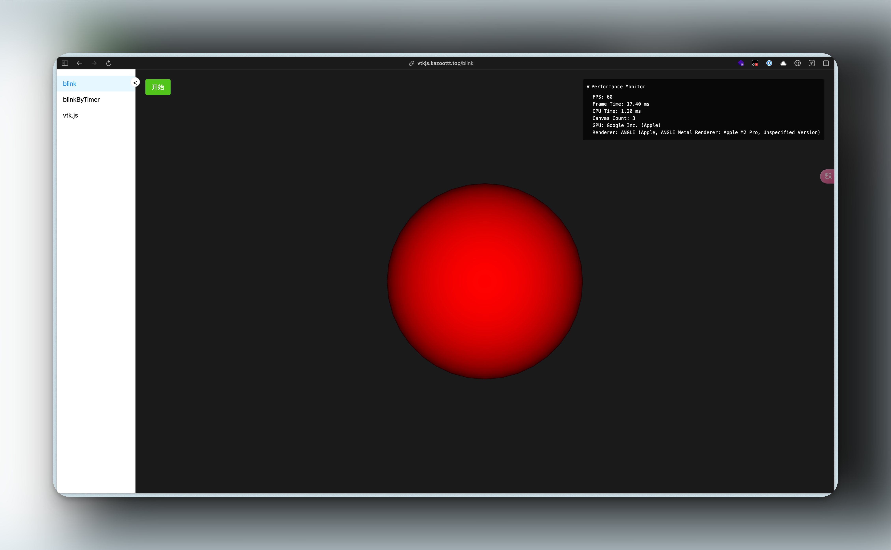

# [react-vtk-js](https://github.com/KazooTTT/vtkjs-react-demos)

This is a practice project to use vtk.js. The demos are from the vtk.js documentation and my own writing.

## Project Structure

the project structure is generated by vite-plugin-pages which means the router is page based.
so you can find the source code in the `src/pages` directory easily.

## preview the demo

see the [website](https://vtkjs.kazoottt.top/blink)

